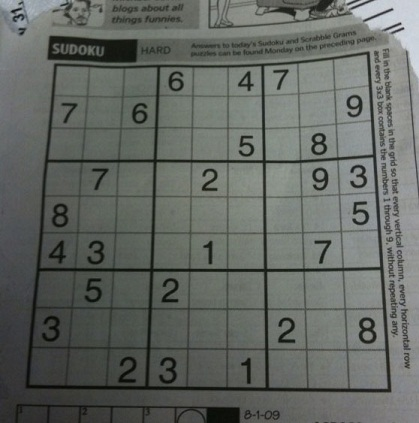
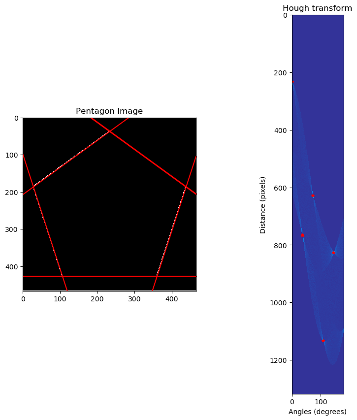
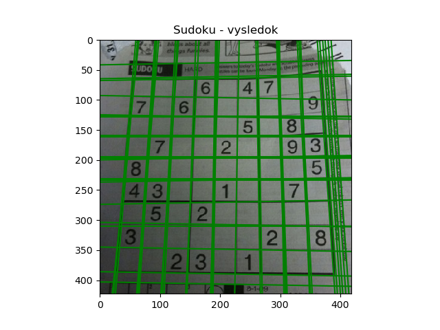

# Druhá úloha - Houghova transformácia

## Vstupné obrázky
Pre testovanie sme použili tri rôzne obrázky, ktoré sú v priečinku `test_images`,
- jednoducký, s ľahko identifikovateľnými hranami


- trochu komplikovanejší, ale stále s jasnými hranami



- komplikovaný, ale ešte s viditeľnými hranami 


## Predspracovanie

Pre úspešné použitie *houghovej transformácie* je potrebné dostať obraz do formy, kde sú zdetekované hrany. Za týmto účelom sme použili **Cannyho hranový detektor**, ktorý pozostáva zo štyroch krokov: 
1. Aplikovanie *Gausovho filtra* na odstránenie šumu
2. Nájdenie intezity grandietu a smeru hrany
3. Stenšenie hrán pomocou odobratia bodov, ktoré nie sú lokálnymi maximami
4. Aplikovanie prahovania na zachovanie bodov s vysokým gradietom

Najvýraznejší vplyv malo vhodne zvolené prahovanie, a to také, v ktorom sa bral ohľad na komplexnosť obrázka, pri jednoduchom sme volili vysoký prah, no a čím bol obrázok komplikovanejší tým bolo lepšie aj voliť nižšie prahy.

  Dostali sme takéto výsledky:


- použili sme 75%-ný prah (75% max. hodnoty v obrázku)


- použili sme 10%-ný prah, pri vyšších sme prichádzali o niektoré hrany


- použili sme 30%-ný prah, tu sme zaznamenali vysokú náchylnosť na voľbu tohto prahu, keďže ide o komplikovaný obrázok, 30 bol výsledný kompromis.

## Aplikovanie Hougovej transformacie

Po pripravení obrázkov sme mohli pristúpiť k samotnej **Houghovej transformácií**

Dosiahli sme nasledovné výsledky:







## Spustenie programu

Zadanie bolo vypracovane v jazyku Python, v3, takže tento je potrebné mať. Boli použité knižnice:

**numpy** a **matplotlib**, takže pred spustením je potrebné ich nainštalovať:

```
pip install numpy matplotlib
```
Spustenie:
```
python hough_transform.py
```


